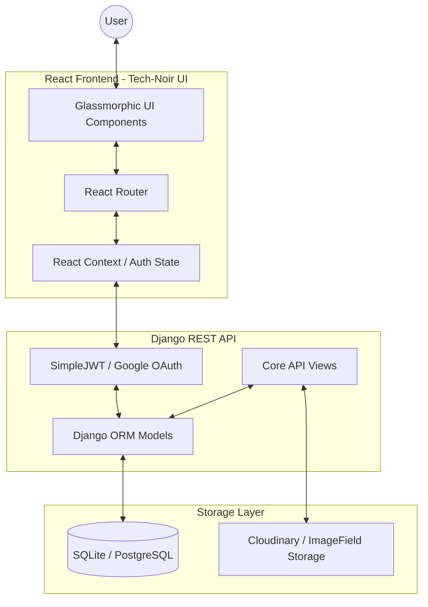
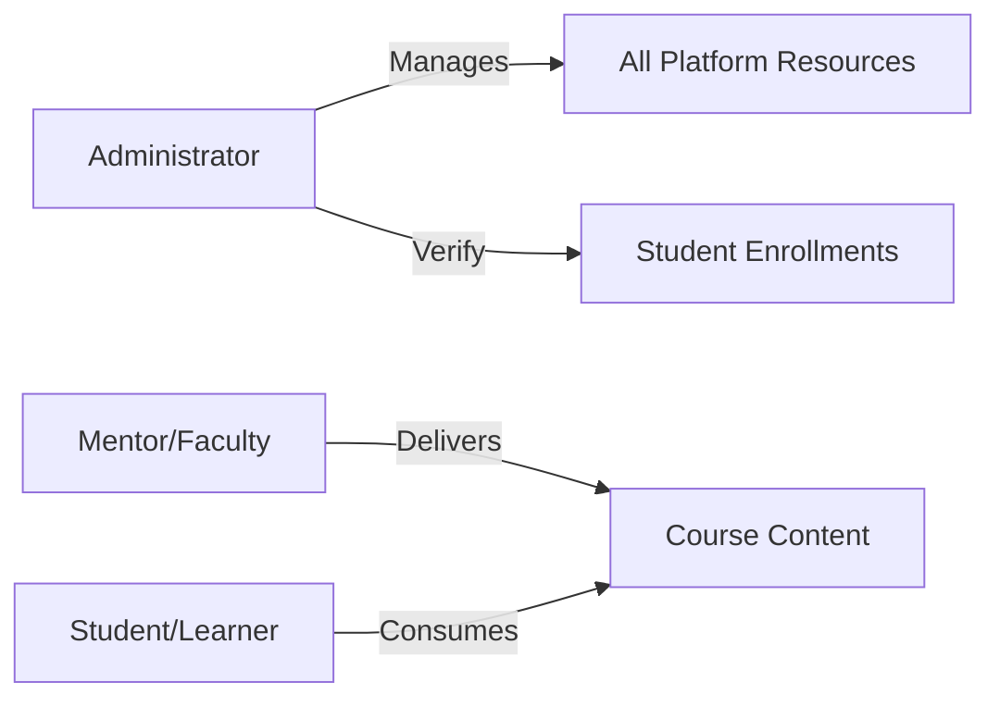
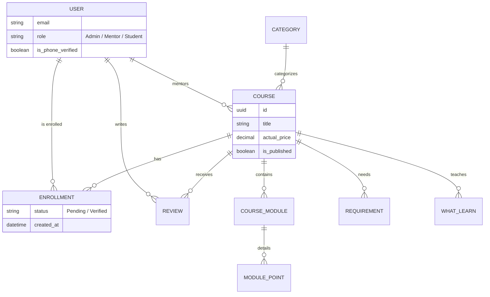
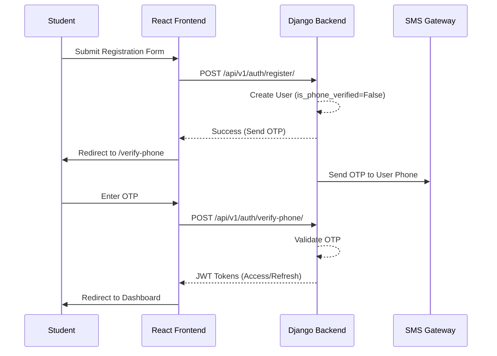

# Software Requirements Specification (SRS)
## Eduflow LMS: Design School Platform

### 1. Introduction
#### 1.1 Purpose
The purpose of this document is to provide a detailed overview of the Software Requirements for the **Eduflow LMS (Design School)**. It defines the functional and non-functional requirements, architecture, and user flows for the platform, ensuring a cinematic, "Tech-Noir" learning experience.

#### 1.2 Scope
Design School is a specialized Learning Management System (LMS) designed for creative professionals. It handles course management, live session tracking, automated certification, and a cinematic student workspace.

#### 1.3 Definitions, Acronyms, and Abbreviations
- **DRF**: Django REST Framework
- **JWT**: JSON Web Token
- **OTP**: One-Time Password
- **Tech-Noir**: A design aesthetic combining high-tech futuristic elements with dark, cinematic overlays and glassmorphism.

---

### 2. System Architecture
The system follows a decoupled architecture with a Django/DRF backend and a React (Vite) frontend.

---

### 3. Functional Requirements

#### 3.1 Authentication & Authorization
- **R1.1**: The system shall support Email/Password registration.
- **R1.2**: The system shall support Google OAuth 2.0 integration.
- **R1.3**: New users must undergo Phone Verification via OTP before accessing the dashboard.
- **R1.4**: Secure session management using JWT (Access & Refresh tokens).

#### 3.2 User Roles

#### 3.3 Admin Workspace (Operations Console)
- **Identity Management**: Manage users, roles, and verification status.
- **Curriculum Control**: Shape course structures, pricing, and publishing.
- **Review Queue**: Grade assignment submissions and track student progress.
- **Certification**: Define and issue automated certificates.

---

### 4. Database Schema (ER Diagram)
The following diagram illustrates the core entities and their relationships within the platform.

---

### 5. Key User Flows

#### 5.1 Registration & Verification Sequence

---

### 6. Non-Functional Requirements

#### 6.1 Performance
- **P1**: Page transitions should be handled by Framer Motion for a 60fps feel.
- **P2**: API responses should typically occur within < 200ms for standard CRUD operations.

#### 6.2 Security
- **S1**: All passwords must be hashed using PBKDF2 with SHA256.
- **S2**: JWT tokens must be stored in HTTP-only cookies or handled via secure state management to prevent XSS.
- **S3**: Admin Panel access restricted to users with the `admin` role.

#### 6.3 Aesthetics (Tech-Noir Design)
- **A1**: The UI must utilize glassmorphism (backdrop-blur) and dark-themed gradients.
- **A2**: Interactive elements must provide micro-animations on hover and focus.

---

### 7. Setup & Installation
Refer to the `backend/` and `frontend/` directories for specific environment requirements and dependency installations.

1. **Backend**: `pip install -r requirements.txt && python manage.py migrate`
2. **Frontend**: `npm install && npm run dev`